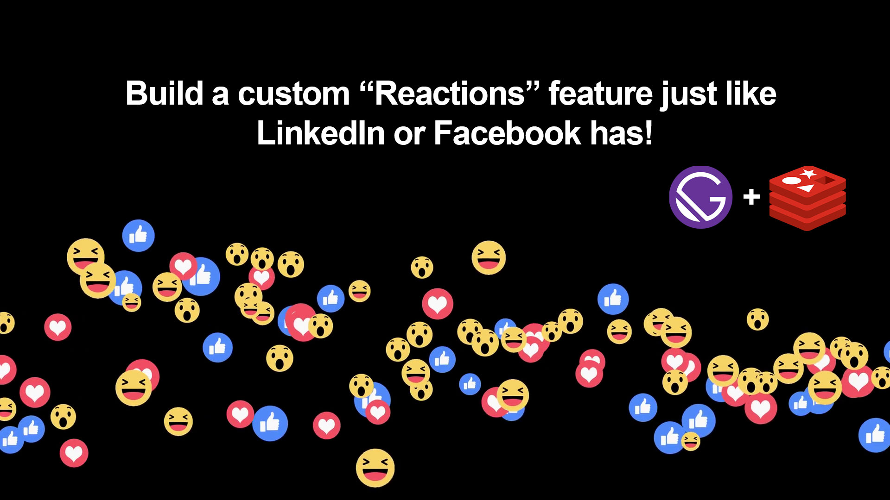
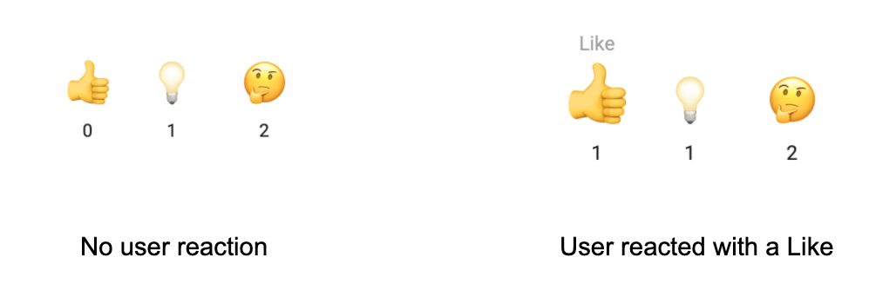

# A blog demonstrating how you can add custom LinkedIn-like reactions to your blog posts with serverless Redis.

This repo is a source code for my [article]() with a detailed explanation of how I used serverless Redis to create the reactions feature.

You can see reactions in action on my website. Pick any post and you will find reactions at the bottom of the post. For instance, this [post](https://techforitrecruiters.com/blog/2021-05-11-what-is-a-full-stack-developer/)

#### I use Netlify both for deployment and development
- To use [netlify](https://www.netlify.com/) in development you need `npm install netlify-cli -g`
- Read the [docs](https://docs.netlify.com/) for more details.

#### The backend is built with Netlify [functions](https://www.netlify.com/products/functions/).
- Functions are in `/lambda` folder:
    - `reactions.js` GET - returns all requestions for a given post id
    - `react.js` POST - store a reaction in Redis

#### Reactions component
- Requires post id. See `src/templates/blog-post.js`

    `<Reactions id={post.id} />`

#### Env variables
- You need to have env. variables set for development/deployment:
    - REDIS_PORT=
    - REDIS_HOST=
    - REDIS_PASSWORD=
    - SENTRY_DSN={optional}
#### Redis
- I use Serverless Redis from [Upstash](https://upstash.com?utm_source=sndr_1)

Cloned from [Gatsby's blog starter](https://github.com/gatsbyjs/gatsby-starter-blog)